# 开发ETH区块链应用：领养宠物

## 应用简介

一个简单的领养宠物的业务，总共8个宠物可以被领养。
领养的后台逻辑和存储运行在区块链中，前台的逻辑在nodejs中运行。

## 运行所需依赖
- nodejs 8+
- truffle：编译和部署智能合约的框架
- git：truffle命令需要在git bash运行
- npm：安装和启动应用
- testrpc：在本机运行一个简单的私有的测试区块链
- Chrome及其插件MetaMask：用来批准领养操作，并支付费用

## 搭建开发环境
- nodejs、git、vscode、Chrome和npm安装：略
- truffle和testrpc安装：npm install -g truffle testrpc
- MetaMask安装：用Chrome浏览https://metamask.io/， 按指引安装
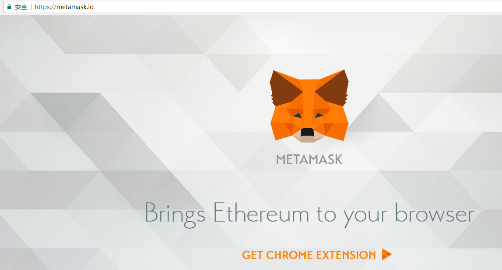
- 依赖安装：在根目录下运行npm install

## 项目目录结构
- /build：truffle编译智能合约后的ABI文件
- /contracts：Solidity语言编写的智能合约
- /doc：文档
- /migrations：truffle使用迁移系统来处理智能合约的部署。一个迁移也是智能合约，能记录改变。
- /test：用来测试智能合约的代码
- truffle.js：truffle自己的配置文件

## 重要文件简介
- /contracts/Adoption.sol：用来部署到区块链的应用的后台业务逻辑和数据存储的智能合约
- /src/js/app.js：前台业务逻辑

## 编译和迁移智能合约

### 编译
在根目录命令行输入运行测试区块链网络：

`testrpc`

如下截图为vscode的终端显示，如果正常都类似，有：账户、私有键、助记词、监听8545等信息。抄写下Mnemonic（助记词）为MetaMask所用。不要关闭，让其运行在后台。

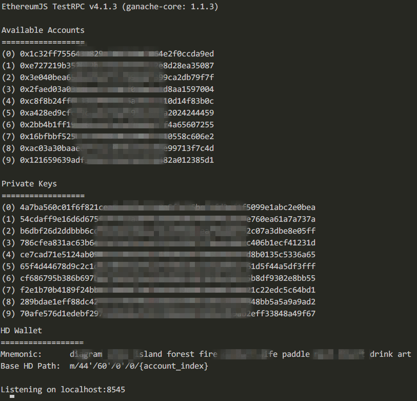

打开另外一个终端。如果是windows操作系统，在文件目录的根目录下启动git bash，因为在windows命令行运行truffle命令会打开truffle.js。

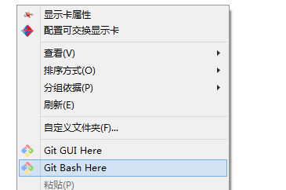

在git bash中运行编译命令，在build目录应该会生成对应的json文件：

`truffle compile`

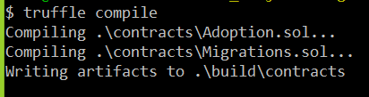

### 迁移和部署
- /migrations/1_initial_migration.js：用来部署Migrations.sol
- /migrations/2_deploy_contracts.js：用来部署Adoption.sol

在刚才执行了compile的git bash中继续运行：如果成功，则类似如下截图，就表示成功将智能合约部署到了本地的测试区块链网络中了。

`truffle migrate`

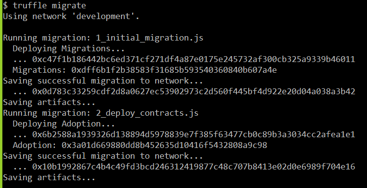

## 测试智能合约

具体的测试用例去/test目录的TestAdoption.sol查看，根目录下，通过git bash下运行命令。

`truffle test`

先忽略某些警告，运行结果应该类似如下：

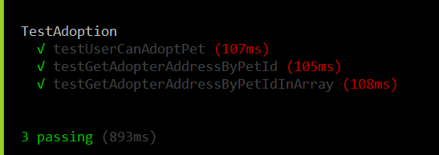

## 运行前端nodejs，并在Chrome浏览器上和部署好的智能合约交互

### 首先确定MetaMask插件能运行并导入刚才运行testrpc的账号
点击右上角的狐狸图标，并点击：Restore from seed phrase

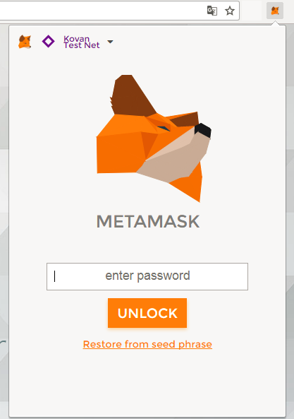

将刚才运行testrpc时生成的助记词输入到wallet seed，输入密码：

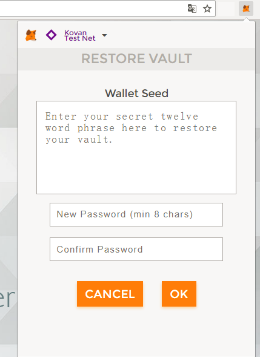

进入后选择网络Localhost 8545，你的账号应该有接近100ETH。系统生成100个初始值，然后部署中耗费了部分。

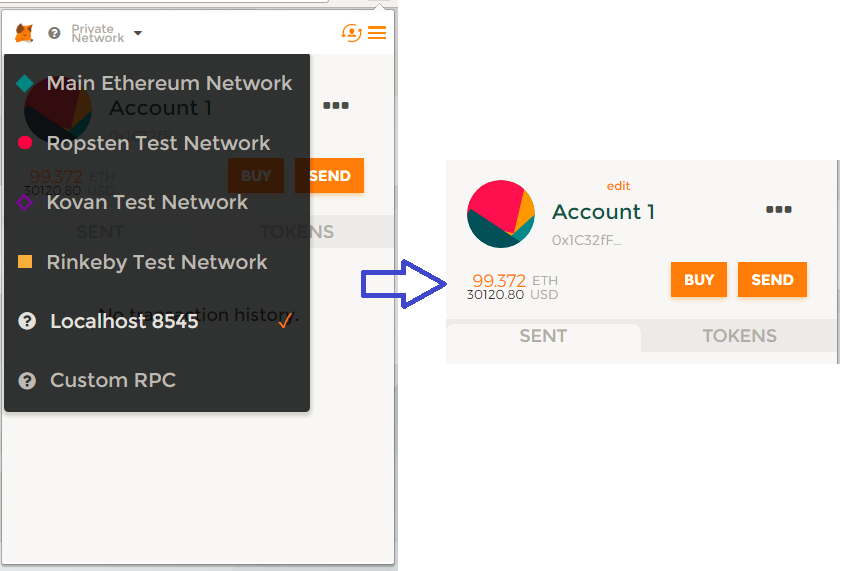

### 运行，并用MetaMask测试业务

开启另外一个windows命令行，根目录下运行：

`npm run dev`

浏览：http://localhost:3000/
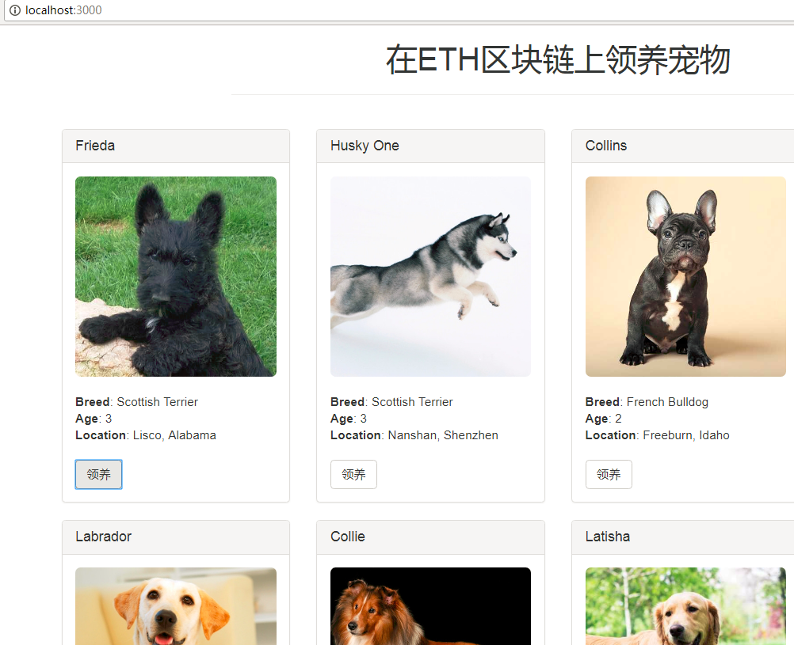

点击“领养”按钮，会弹出MetaMask让你确认，点击弹出框的"Submit“按钮。

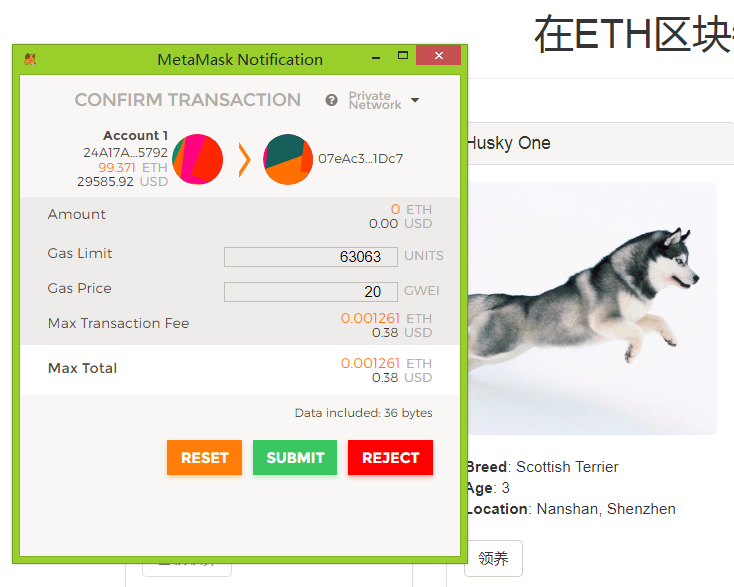

最后，这个已经领养信息将会在区块链网络得到确认并保存，在metamask中将有对应的transaction，而对应宠物的按钮会置灰，即使刷新页面也是如此。

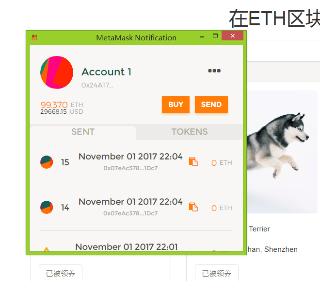

## 注意点
- 目前，testrpc有活跃连接时，无法响应ctrc + c关闭，需要在断开MetaMask的连接后才行。比如将MetaMask连接到Kovan等网络，再在testrpc终端进行ctrc + c才有效。
- 智能合约的信息都是保存区块链网络中，如果关闭对应的网络，所有信息都消失，比如关闭testrpc。部署在kovan中，可以保存长久。

## 打赏些ETH

觉得有帮助， 打赏ETH到下面账号，推荐使用imToken轻钱包：**0xb8cBDCcb370789a4b3645Ab3C3992D1597c8B15B**

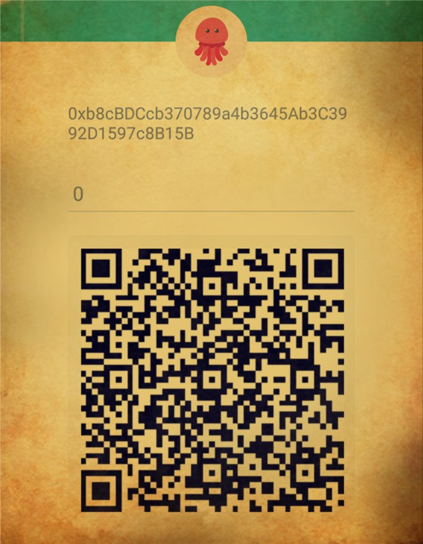
